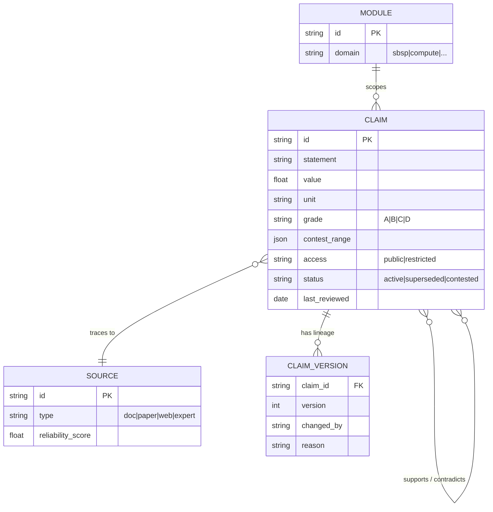
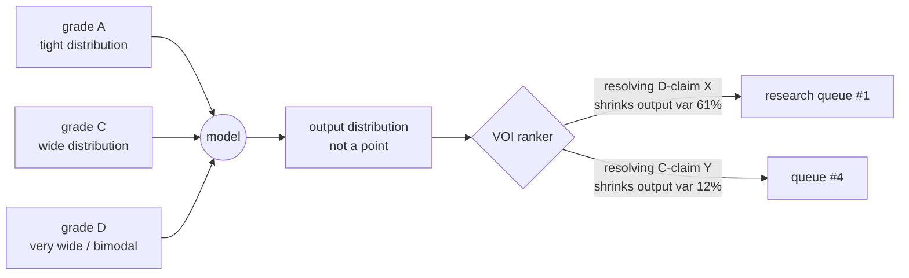

# Substrate — Architecture for an Intelligence of Its Own
**CetaLabs · v1.0 · 2026-07-05**
**Companion to:** PRD v0.2, substrate_v2.html (functional MVP)

---

## 0. BLUF

Substrate today is an **instrument**: it displays graded claims and recomputes when you move sliders. It becomes an **intelligence** when it does four things unprompted: (1) notices when a stored claim contradicts a new source, (2) knows which unresolved uncertainty is most worth resolving next, (3) detects when its own numbers have gone stale, and (4) learns which sources and graders were reliable in hindsight. Every layer below is specified with two thresholds — **MVP (credible bare minimum)** and **GREAT (intelligence of its own)** — so build effort maps to the 90-day Cosmos window without foreclosing the long game.

The architecture is seven layers. Only three need real investment in the next 90 days (L1, L3, L4 — marked ●). The rest have cheap MVP forms that must merely not block the great version later.

```
        ┌────────────────────────────────────────────────────┐
        │  L7 · PRESENTATION & NARRATIVE     (views, Fable)  │
        ├────────────────────────────────────────────────────┤
        │  L6 · ORCHESTRATION & AGENTS       (Hannachan)     │
        ├────────────────────────────────────────────────────┤
        │  L5 · FORECASTING & ECONOMETRICS   (event shocks)  │
        ├────────────────────────────────────────────────────┤
     ●  │  L4 · UNCERTAINTY ENGINE           (the meta-eval  │
        │       grade propagation · VOI       DNA — moat)    │
        ├────────────────────────────────────────────────────┤
     ●  │  L3 · SIMULATION / MODEL REGISTRY  (pure functions,│
        │       fixtures, sensitivity)        per domain)    │
        ├────────────────────────────────────────────────────┤
        │  L2 · EXTRACTION & CORROBORATION   (LLM pipelines) │
        ├────────────────────────────────────────────────────┤
     ●  │  L1 · CLAIM SUBSTRATE              (provenance     │
        │       schema · versioning · graph)  store — root)  │
        └────────────────────────────────────────────────────┘
              ▲ every layer reads/writes claims; nothing
                bypasses L1 — that is the integrity rule
```

---

## 1. L1 — Claim Substrate (data architecture root)

**What it is.** The single source of truth: atomic claims with provenance, grade, contest range, version lineage, and access marking (public/restricted — R's IP boundary lives here, enforced at the data layer, not the UI).

**Why it's the root.** Every other layer is a producer or consumer of claims. If L1 is weak, "intelligence" upstream is confabulation with extra steps.



| Threshold | Specification |
|---|---|
| **MVP** | Flat JSON files in a git repo, one file per claim, schema from PRD v0.1 §4.1 + `access` field. Git history *is* the version lineage. Contradiction links added by hand. ~2 days of work; already 80% specified. |
| **GREAT** | Claim graph (SQLite+JSON1 or DuckDB first; graph DB only if edges exceed ~10k). Typed edges: `supports`, `contradicts`, `derives_from`, `supersedes`. Temporal validity windows (a launch price claim is true *of a date*). Automatic staleness decay: grade C claims older than N months auto-flag for re-verification. Access control enforced on query, not display. |
| **Intelligence test** | The system can answer: *"which active claims does this new source contradict?"* without a human framing the question. |

---

## 2. L2 — Extraction & Corroboration (ML/AI ingestion)

**What it is.** Two pipelines: (a) **extraction** — document → claim candidates (the MCD Phase-0 pattern, generalized); (b) **corroboration** — claim → independent external estimates with source reliability noted (the stage-4 research pull, hardened).

```
  doc (MCD, paper, filing)          claim in registry
        │                                  │
        ▼                                  ▼
  ┌──────────────┐                 ┌───────────────┐
  │ chunk + parse │                │ query planner │  ← builds 2-3 search
  └──────┬───────┘                 └──────┬────────┘    strategies per claim
         ▼                                ▼
  ┌──────────────┐                 ┌───────────────┐
  │ LLM extract  │                 │ multi-source  │
  │ → candidates │                 │ retrieval     │
  └──────┬───────┘                 └──────┬────────┘
         ▼                                ▼
  ┌──────────────┐                 ┌───────────────┐
  │ HUMAN GATE   │◄── never ───►   │ agreement     │
  │ grade + sign │    skipped      │ scorer        │
  └──────┬───────┘                 └──────┬────────┘
         ▼                                ▼
     L1 write                     tighten / widen / contradict
                                      annotation on claim
```

| Threshold | Specification |
|---|---|
| **MVP** | Extraction: one Claude call per document section with a strict JSON claim-candidate schema; human grades everything (R sessions). Corroboration: one web-search call per claim, output = tighten/widen/within + named source (already built in substrate_v2). |
| **GREAT** | Extraction: cross-document entity resolution (the "four LCOEs, three generations" problem solved structurally — same quantity recognized across docs and auto-linked `supersedes`/`contradicts`). Auto-grade *suggestions* with calibration tracking: log suggested vs human-assigned grade; when agreement is proven high on A/B suggestions, only C/D need full review. Corroboration: source reliability scores updated in hindsight (did this org's estimates hold up?); scheduled re-runs on staleness flags from L1. |
| **Intelligence test** | Fed a new document, the system says: *"3 candidate claims, 1 contradicts claim sbsp-launch-001 (active), suggest supersede review"* — the F-2/F-4 findings produced automatically instead of by Claude reading 4,500 lines. |
| **IP rule (hard)** | Anything touching restricted claims (MCD component costs) runs only via Anthropic API or local Ollama. Never DeepSeek or unvetted endpoints. Enforced in the pipeline config, not by memory. |

---

## 3. L3 — Simulation / Model Registry

**What it is.** Deterministic domain models: pure functions from parameters → outputs, each with test fixtures. The SBSP LCOE model (fixtures T1–T4, passing) is the template.

| Threshold | Specification |
|---|---|
| **MVP** | One TypeScript/JS module per domain: `model(params) → outputs`, fixtures in the same file, CI fails if fixtures break. Sensitivity = brute-force parameter sweep (already built). No shared framework — copy the pattern. |
| **GREAT** | Model registry with a typed contract: declared inputs (claim IDs, not raw numbers), declared outputs, units checked at registration (a `$/kg` claim cannot feed a `%` input — unit errors are the most common silent killer in techno-economic models). Monte Carlo over contest ranges with *correlated* draws (launch cost and satellite unit cost are not independent). Auto-generated tornado + fixture report per model version. |
| **Intelligence test** | Registering a new model automatically produces: which claims it depends on, its full sensitivity profile, and which grade-D dependency dominates its output variance — no bespoke analysis. |

---

## 4. L4 — Uncertainty Engine (the moat; your meta-eval DNA)

**What it is.** The layer that makes Substrate *yours* rather than a dashboard anyone could build: grades become distributions, distributions propagate through models, and the system ranks **which unresolved claim is most worth resolving next** (value-of-information).



| Threshold | Specification |
|---|---|
| **MVP** | Grade → heuristic width mapping (A: ±5%, B: ±15%, C: ±40%, D: full contest range, uniform). Tornado chart *is* the poor-man's VOI: biggest swing = resolve first. Already ~built; formalize the mapping in one config file. |
| **GREAT** | Per-claim distributions (triangular/lognormal chosen by claim type), correlation matrix per module, Monte Carlo propagation, formal VOI: expected reduction in decision-relevant output variance per claim resolved, *divided by estimated cost to resolve* (a $500 supplier quote beats a $50k study). Calibration loop: when claims resolve, score whether the prior distribution covered the realized value — this is Brier-style scoring applied to your own grading practice, and it is publishable meta-evaluation research. |
| **Intelligence test** | The system tells R: *"your cheapest 3 actions to firm the client quote are: get one launch LOI (resolves 61% of variance), one rectenna land quote from IRDA (18%), one WPT chain test report (9%)"* — a research agenda generated from uncertainty structure. |
| **Career note** | L4-GREAT is simultaneously the Cosmos demo, an MA thesis chapter (meta-evals cluster D), and the think-tank differentiator. If effort must concentrate anywhere, it is here. |

---

## 5. L5 — Forecasting & Econometrics

**What it is.** Time and events enter the system: parameter trajectories (launch cost decline curves), event shocks (export controls → capex multiplier — the Compute-Politik pattern), and news-triggered claim updates.

| Threshold | Specification |
|---|---|
| **MVP** | Scenario sliders only (already built: export-control shock ×). Trajectories = two hand-drawn curves (optimistic/conservative) per key parameter, stored as claims with grade D. Zero ML. |
| **GREAT** | Event-shock library: typed events (export restriction, launch failure, subsidy change) with distributions over parameter impacts, composable into scenarios. News watcher (L6 agent) maps headlines to candidate events → human confirms → parameters update with lineage. Forecast calibration: every dated forecast is logged and scored when resolution arrives (Brier), building an auditable track record — the credibility asset a think tank actually trades on. |
| **Intelligence test** | A real export-control announcement appears; within a day the system proposes: *"event E-17 (restriction class B) matches; historical impact distribution suggests +15–40% accelerator capex; affected outputs: Module-2 $/GPU-hr, cross-module crossover year."* |

---

## 6. L6 — Orchestration & Agents (Hannachan's lane)

**What it is.** The scheduling nervous system: staleness sweeps, corroboration re-runs, deadline-aware research queues, news watching. This is where the Hetzner/Hermes/Telegram infrastructure plugs in.

| Threshold | Specification |
|---|---|
| **MVP** | None. A human clicking "pull corroboration" is the orchestrator. Acceptable for 90 days. |
| **GREAT** | Cron-driven agent tasks reading the L1 staleness flags and L4 VOI queue: nightly *"5 claims need re-verification, 2 news items match watched entities."* Telegram digest to Sha/R. All agent writes land as *candidates*, never directly as active claims — the human gate from L2 is architectural, not procedural. Langfuse traces on every agent run (observability you already run). |
| **Intelligence test** | You stop remembering to check whether launch prices moved; the system remembers for you and tells you only when it matters (VOI-weighted alerting, not noise). |

---

## 7. L7 — Presentation & Narrative

**What it is.** Views bound to the module contract: parameter dashboard, supply-chain tree, cross-module levers (all built), map view (Unseen Empire port), and — v2+ — Fable as the narrative walkthrough for non-technical audiences.

| Threshold | Specification |
|---|---|
| **MVP** | Built (substrate_v2.html). Three audience renderings of one model satisfy the bridge thesis. |
| **GREAT** | View registry: any view binds to any module exposing the contract. Audience-mode exports (investor PDF with A/B-only claims; client quote sheet with band + gate list; engineering full registry). Fable integration *only here* — narrative parameter cascades ("watch what happens to the PPA price when launch slips 18 months") after L3/L4 are stable. |
| **Intelligence test** | Adding Module 3 (any new domain) requires zero view code. |

---

## 8. Build order (Pareto, 90-day window)

```
Weeks 1–2   L1-MVP: claim repo + schema + access field        ██
Weeks 1–3   L2-MVP: Phase-0 extraction sessions with R        ████
Weeks 3–5   L3-MVP: harden SBSP model, port compute model     ████
Weeks 5–7   L4-MVP: grade→width config + formalized tornado   ███
Weeks 7–9   L4-GREAT (partial): Monte Carlo + naive VOI       ████  ← the Cosmos demo
Weeks 9–12  Polish, external test (F1 criterion), screenshot  ███
────────────────────────────────────────────────────────────────
Deferred    L5-GREAT, L6, L7-GREAT, Fable                     v2+
```

The single deliberate bet: **L4 partial-GREAT inside the window.** A working VOI ranking ("resolve this claim next, here's why") is the moment Substrate stops being a dashboard in front of a reviewer — and it's the demo neither a Replit app nor a 200-page PDF can make.

## 9. Decision log (pre-committed, revisit only on evidence)

| # | Decision | Rationale | Revisit if |
|---|---|---|---|
| D1 | JSON-in-git before any database | Auditability is a feature; premature DB adds ops load with zero user value at current claim counts | >2k claims or >3 concurrent editors |
| D2 | Human gate on all claim writes, forever | The credibility story collapses the first time a hallucinated claim ships; "intelligence" proposes, humans dispose | Never (this is identity, not optimization) |
| D3 | L4 before L5/L6 | Uncertainty engine is moat + thesis + demo; forecasting without it is vibes with charts | Cosmos reviewer feedback demands forecasting |
| D4 | Restricted-claim inference: Anthropic API / Ollama only | Research IP rule (MCD) | Never |
| D5 | Fable deferred to post-L4 | Narrative on top of unstable numbers is expensive theater | L3+L4 fixtures stable for 30 days |
